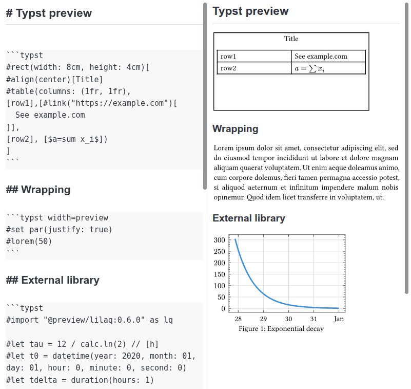

# JoTypst

Render Typst snippets in the Markdown preview of Joplin desktop.



Install the [Typst CLI](https://typst.app/open-source/) and make sure the `typst` command is available to Joplin. Then write a fenced code block:

````markdown
```typst
#align(center)[Hello from Typst!]
```
````

The fence header controls the page width:

- `typst` or `typst width=auto`: size the page to its content.
- `typst width=preview`: wrap content to the preview pane width, recompiling when the pane changes size.
- `typst width=400pt`: use a fixed page width in Typst points (replace `400` with any positive number).

For example, use this fence to enable wrapping:

````markdown
```typst width=preview
A long line of text that will wrap to the preview pane width.
```
````

The plugin compiles each snippet to an SVG locally with a 2 pt margin and transparent background. Errors appear in the preview. Each block is compiled independently, so imports, external files, and multi-page documents are outside this first version's scope. If Joplin does not find `typst`, launch Joplin from a shell with Typst on its `PATH`.

Build with `npm run dist` and install the resulting `.jpl` from `publish/` in Joplin's plugin settings.

## Requirements

- Joplin Desktop 3.7 or later
- Typst CLI available in Joplin's `PATH`

## License

MIT
